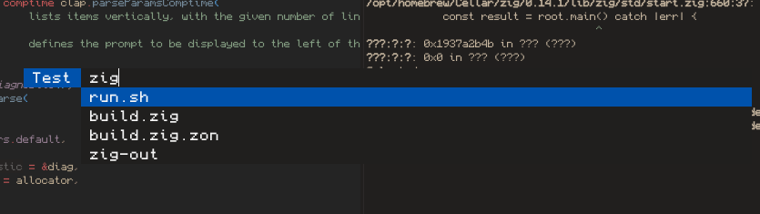

# de_menu

De dynamic menu, like dmenu, but new and shiny. Built to serve my usages, avoiding the need for X11/xQuartz and a reason to use Raylib.

## Overview

You get a menu that can be typed into to filter the list items recieved from stdin.
List items are traversable with the up/down arrow keys and tab to saturate the input
with the hovered field. Pressing enter returns the selected item to stdout.

### Example

Using a simple script:

```bash
#!/usr/bin/env bash

echo "Selected: $(ls -t1 | zig-out/bin/de_menu -p Test)"
```

A menu appears, and with some typing into the input:



Traversing the list, and selecting the `build.zig` entry, and pressing enter then yields `Selected: build.zig` in stdout.

## Build and Run

Normal zig build shenanigans:

```bash
zig build
```

Run it:

```bash
./zig-out/bin/de_menu [options ...]
```

You can move the binary to wherever you want and it'll work fine.

## Known Issues

* The filtering is a bit busted since its over Unicode codepoints and zig's `std.mem.contains` doesn't seem to work correctly.
* Scrolling via list traversal is not implemented yet.
* Exceeding render boundary on text doesn't shift the visible text window yet.
* 1:1 compatibility with dmenu hasn't been achieved yet.
* Using a local fixed-path font for now, replace it with your own in `src/renderer.zig` if you want.

## Notes

I might port the manual rendering to use raygui instead to support stylesheets and all that good stuff. For now, features are more important, the current UI is good enough.

All the configuration for styling is emedded in the renderer at the moment, at some stage it'll be configurable via CLI options and/or dotfiles.
